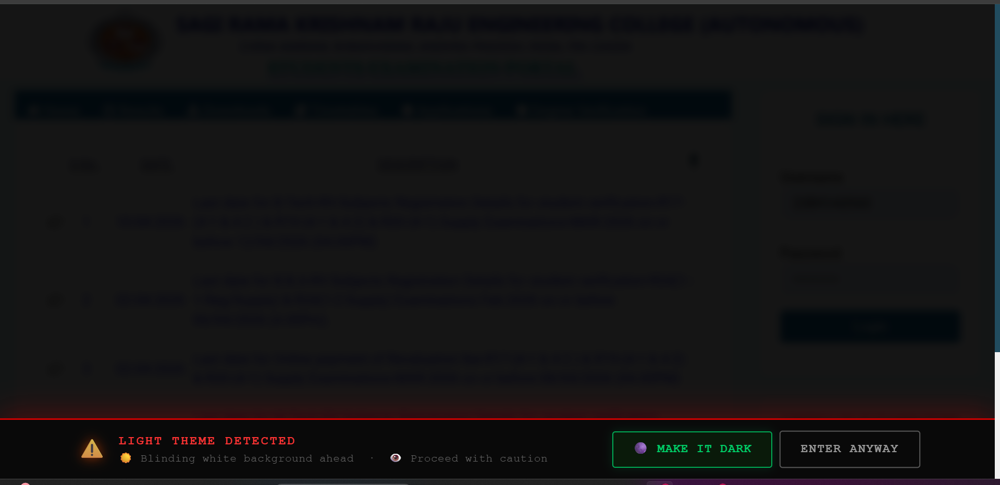

# DarkExt 🌑

DarkExt is a tiny Chrome extension that warns you before opening super bright websites and lets you switch to a darkened view instantly.

## What it does
- Detects bright page backgrounds
- Shows a warning bar before you continue
- Adds a quick floating dark-mode toggle

## Install (Developer Mode)
1. Open `chrome://extensions`
2. Enable **Developer mode**
3. Click **Load unpacked**
4. Select this project folder

Stay safe from flashbang pages 😎
